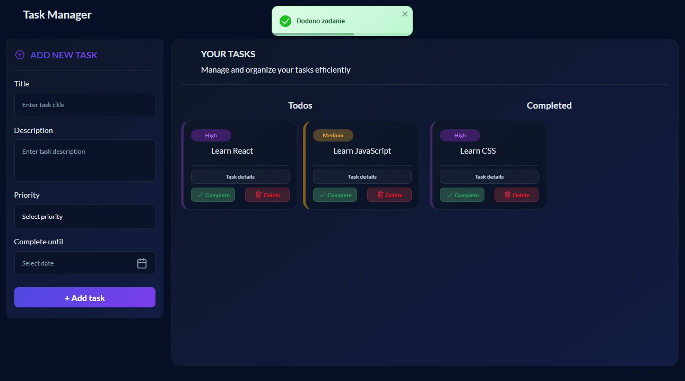

# Task Manager



A modern and fully responsive task management application built with React.

The application allows users to create, organize, and manage daily tasks through an intuitive and user-friendly interface. Tasks can be categorized by priority, assigned a deadline, marked as completed, and viewed in a detailed modal window.

## Features

* Create new tasks
* Add task descriptions
* Set task priority (Low, Medium, High)
* Assign task deadlines
* Mark tasks as completed
* Delete tasks
* View task details in a modal window
* Form validation
* Toast notifications
* Fully responsive design
* Modern dark-themed user interface

## Technologies

* React
* JavaScript (ES6+)
* CSS3
* React Hooks (`useState`)
* React Toastify
* React DatePicker
* React Icons
* Ionicons

## Responsive Design

The application is fully responsive and optimized for:

* Desktop
* Laptop
* Tablet
* Mobile devices

Responsive layouts are implemented using Flexbox and CSS Media Queries.

## Installation

```bash
git clone https://github.com/Karolina-S-dev/React-todo-app.git
npm install
npm start
```

## What I Learned

During this project I practiced:

* React component architecture
* State management with React Hooks
* Form handling and validation
* Conditional rendering
* Dynamic list rendering
* Creating reusable components
* Responsive web design
* Integration of third-party libraries

---

# Task Manager 🇵🇱

Nowoczesna i w pełni responsywna aplikacja do zarządzania zadaniami stworzona w React.

Aplikacja umożliwia tworzenie, organizowanie i zarządzanie codziennymi zadaniami za pomocą intuicyjnego interfejsu. Zadaniom można przypisywać priorytety, terminy realizacji, oznaczać je jako ukończone oraz przeglądać ich szczegóły w oknie modalnym.

## Funkcjonalności

* Dodawanie nowych zadań
* Dodawanie opisu zadania
* Ustawianie priorytetu (Niski, Średni, Wysoki)
* Ustalanie terminu wykonania
* Oznaczanie zadań jako ukończone
* Usuwanie zadań
* Podgląd szczegółów zadania
* Walidacja formularza
* Powiadomienia Toast
* Responsywny interfejs użytkownika
* Nowoczesny ciemny motyw

## Technologie

* React
* JavaScript (ES6+)
* CSS3
* React Hooks (`useState`)
* React Toastify
* React DatePicker
* React Icons
* Ionicons

## Responsywność

Aplikacja została zoptymalizowana dla:

* komputerów stacjonarnych
* laptopów
* tabletów
* urządzeń mobilnych

Układ automatycznie dostosowuje się do rozmiaru ekranu przy użyciu Flexbox oraz Media Queries.

## Instalacja

```bash
git clone https://github.com/Karolina-S-dev/React-todo-app.git
npm install
npm start
```

## Czego nauczyłam się podczas projektu

* budowy aplikacji w oparciu o komponenty React
* zarządzania stanem za pomocą Hooków
* obsługi formularzy i walidacji danych
* renderowania warunkowego
* dynamicznego renderowania list
* tworzenia reużywalnych komponentów
* projektowania responsywnych interfejsów
* integracji bibliotek zewnętrznych


## Autor

**Karolina-S-dev**
